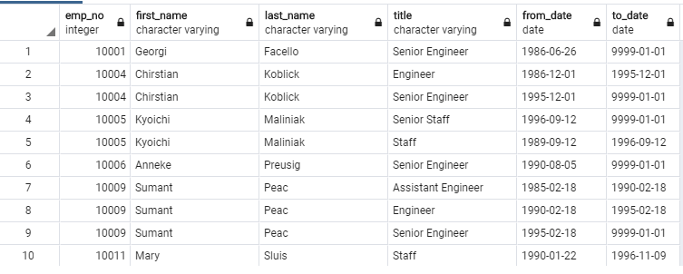
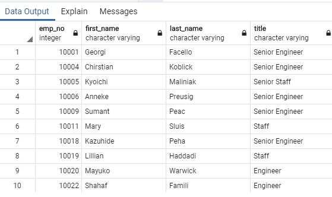
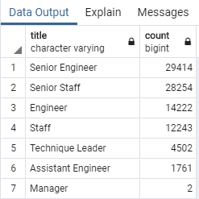
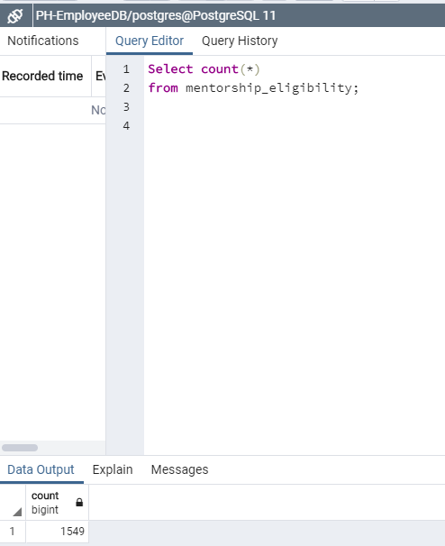
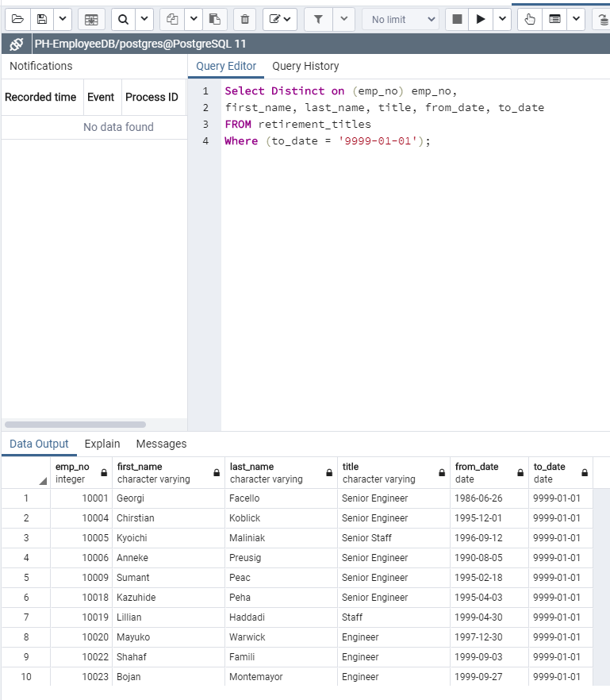

# Pewlett-Hackard_Analysis

## Purpose
The purpose of this assignment was to create a database by merging files and then querying the results in SQL to provide an analysis of employees eligible to retire. By using ERD and SQL, we now have a number of employees eligible to retire as well as find ones who would be eligible to participate in a mentorship program. 

## Results
In Deliverable 1, we looked at all employees and then filtered the data to show employees that were born in between certain years (1952-1955). This gave us all employees that are eligible to retire but it contained multiple titles for each employee.

 

Then we used the SQL query "Distinct On" to make sure we were only counting an employee once (if they had switched job titles). This gave us the unique value so each employee was only counted once. The number of employees that are eligible to retire is 90,398. 

 
 
 Lastly, we grouped the current employees eligible to retire by job title. Over 2/3 of jobs that are eligible to retire is senior engineer or engineer. Only 2 employees out of 90,000 were managers. This leads me to believe this was inaccurately colleced or some senior engineers are actually managers.

 

 In Deliverable 2, we looked at all employees that are eligble to participate in the mentorship program. Here we filtered the employee file to only current employees and ones that were born in 1965. There are 1549 mentorship eligible employees. 
 
 
 
 ## Summary
 
 ** How many roles will need to be filled as the "silver tsunami" begins to make an impact?
 
 There would be 72,458 employees eligible to retire which would mean sometime in the next 10 years these roles would need to be filled. 
 
 ** Are there enough qualified, retirement-ready employees in the departments to mentor the next generation of Pewlett Hackard employees?
 
 There were only 1549 mentorship eligible employees. This is out of 70,0000 employees. I'd suggest widening the mentorship eligible program to more than just employees born 1965.
 
 The biggest issue with this data, was that it included all current and past employees. A better analysis would have been to filter by to-date as well to make sure we were only including current employees to find the true amount of employees eligible to retire. Here we found 72,458 current employees to retire.
 
  

